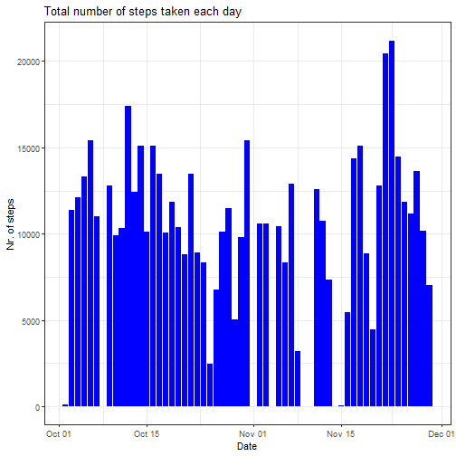
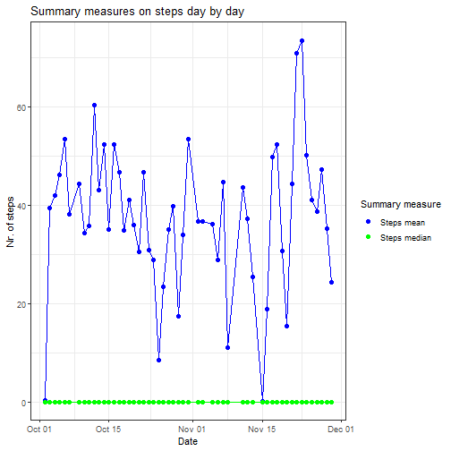
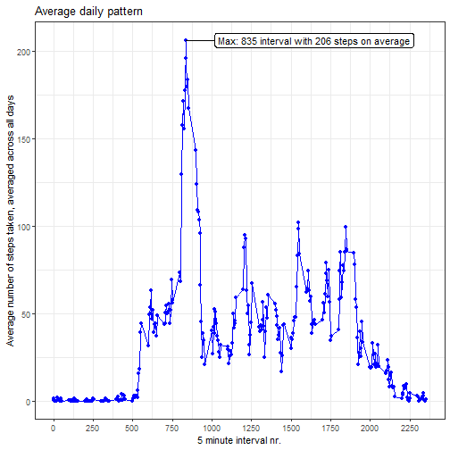
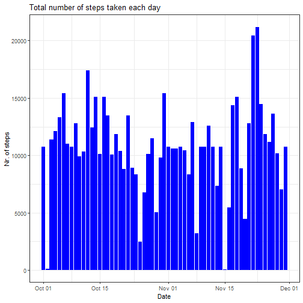
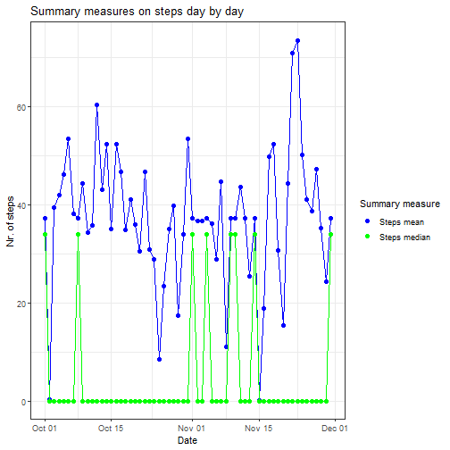
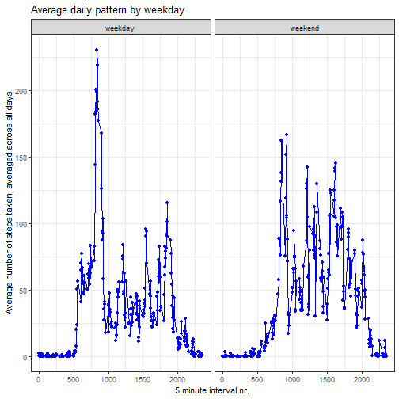

## Loading and preprocessing the data


```r
#### Load libraries

library(tidyverse)
```

```
## -- Attaching packages --------------------------------------- tidyverse 1.3.0 --
```

```
## v ggplot2 3.3.2     v purrr   0.3.4
## v tibble  3.0.3     v dplyr   1.0.1
## v tidyr   1.1.1     v stringr 1.4.0
## v readr   1.3.1     v forcats 0.5.0
```

```
## -- Conflicts ------------------------------------------ tidyverse_conflicts() --
## x dplyr::filter() masks stats::filter()
## x dplyr::lag()    masks stats::lag()
```

```r
library(ggrepel)


#### Look zip file with raw data. If it doesn't exist, download it from web

if(!file.exists("activity.zip")){
  download.file("https://d396qusza40orc.cloudfront.net/repdata%2Fdata%2Factivity.zip", "activity.zip")
}


#### Look if raw data is unzipped, and unzip it if don't

if(!file.exists("activity.csv")){
  unzip("activity.zip")
}


#### Import raw data set
activity_raw <- read.csv("activity.csv")


#### Transform 'date' variable to it's suitable data type.

activity_raw$date <- as.Date(activity_raw$date)
```


## What is mean total number of steps taken per day?


```r
ggplot(activity_raw, aes(x=date,y=steps))+geom_col(fill="blue")+
  labs(title = "Total number of steps taken each day",
        x="Date",
        y="Nr. of steps")+
  theme_bw()
```

```
## Warning: Removed 2304 rows containing missing values (position_stack).
```



```r
ggplot(activity_raw, aes(x=date,y=steps))+
  stat_summary(geom = "point", size= 2, fun = "mean",fun.args = list(na.rm=TRUE), aes(color="Steps mean"))+
  stat_summary(geom = "line", fun  = "mean",fun.args = list(na.rm=TRUE), color="blue")+
  stat_summary(geom = "point", size= 2, fun = "median",fun.args = list(na.rm=TRUE),aes(color="Steps median"))+
  stat_summary(geom = "line", fun = "median",fun.args = list(na.rm=TRUE),color="green")+
  scale_color_manual(values = c("blue","green"))+
  labs(title = "Summary measures on steps day by day",
       x="Date",
       y="Nr. of steps",
       color="Summary measure")+
  theme_bw()
```

```
## Warning: Removed 2304 rows containing non-finite values (stat_summary).
```

```
## Warning: Removed 2304 rows containing non-finite values (stat_summary).

## Warning: Removed 2304 rows containing non-finite values (stat_summary).

## Warning: Removed 2304 rows containing non-finite values (stat_summary).
```



```r
activity_raw %>% group_by(date) %>% summarise(step_mean=mean(steps,na.rm = TRUE),step_median=median(steps,na.rm=TRUE))
```

```
## `summarise()` ungrouping output (override with `.groups` argument)
```

```
## # A tibble: 61 x 3
##    date       step_mean step_median
##    <date>         <dbl>       <dbl>
##  1 2012-10-01   NaN              NA
##  2 2012-10-02     0.438           0
##  3 2012-10-03    39.4             0
##  4 2012-10-04    42.1             0
##  5 2012-10-05    46.2             0
##  6 2012-10-06    53.5             0
##  7 2012-10-07    38.2             0
##  8 2012-10-08   NaN              NA
##  9 2012-10-09    44.5             0
## 10 2012-10-10    34.4             0
## # ... with 51 more rows
```


## What is the average daily activity pattern?


```r
avg_daily_act_pattern <- activity_raw %>% group_by(interval) %>% summarise(step_mean=mean(steps,na.rm = TRUE)) %>% ungroup()
```

```
## `summarise()` ungrouping output (override with `.groups` argument)
```

```r
ggplot(avg_daily_act_pattern,aes(interval,step_mean))+
  geom_point(size=1.5, color="blue")+
  geom_line(color="blue")+
  geom_label_repel(data=slice_max(avg_daily_act_pattern, order_by=step_mean,n=1),
                   aes(label=paste("Max:",interval,"interval with",format(step_mean,digits = 0),"steps on average")),
                   seed =1234,
                   xlim=c(1000, NA),
                   ylim = c(199,NA))+
  labs(title = "Average daily pattern",
       x="5 minute interval nr.",
       y="Average number of steps taken, averaged across all days")+
  scale_x_continuous(n.breaks = 10)+
  theme_bw()
```




## Imputing missing values

For imputing missing values, I'll replace those NA's with the corresponding interval's step mean


```r
#### Number of missing values by variable
colSums(is.na(activity_raw))
```

```
##    steps     date interval 
##     2304        0        0
```

```r
#### Replace NA from activity_raw with interval's step mean from avg_daily_act_pattern

activity_na_removed <- activity_raw %>% inner_join(avg_daily_act_pattern, by="interval") %>% 
                                        mutate(steps=coalesce(steps, step_mean)) %>% 
                                        select(steps,date,interval)

#### Remake plots from the beginning with dataset that has it's missing values filled

ggplot(activity_na_removed, aes(x=date,y=steps))+geom_col(fill="blue")+
  labs(title = "Total number of steps taken each day",
        x="Date",
        y="Nr. of steps")+
  theme_bw()
```



```r
ggplot(activity_na_removed, aes(x=date,y=steps))+
  stat_summary(geom = "point", size= 2, fun = "mean",fun.args = list(na.rm=TRUE), aes(color="Steps mean"))+
  stat_summary(geom = "line", fun  = "mean",fun.args = list(na.rm=TRUE), color="blue")+
  stat_summary(geom = "point", size= 2, fun = "median",fun.args = list(na.rm=TRUE),aes(color="Steps median"))+
  stat_summary(geom = "line", fun = "median",fun.args = list(na.rm=TRUE),color="green")+
  scale_color_manual(values = c("blue","green"))+
  labs(title = "Summary measures on steps day by day",
       x="Date",
       y="Nr. of steps",
       color="Summary measure")+
  theme_bw()
```




## Are there differences in activity patterns between weekdays and weekends?


```r
activity_na_removed$weekday <- as_factor(if_else(weekdays(activity_na_removed$date) %in% c("Saturday","Sunday"),
                                                 true = "weekend",
                                                 false = "weekday")
                                         )


avg_daily_act_pattern_by_weekday <- activity_na_removed %>% group_by(weekday,interval) %>% summarise(step_mean=mean(steps,na.rm = TRUE)) %>% ungroup()
```

```
## `summarise()` regrouping output by 'weekday' (override with `.groups` argument)
```

```r
ggplot(avg_daily_act_pattern_by_weekday,aes(interval,step_mean))+
  geom_point(size=1.5, color="blue")+
  geom_line(color="blue")+
  labs(title = "Average daily pattern by weekday",
       x="5 minute interval nr.",
       y="Average number of steps taken, averaged across all days")+
  scale_x_continuous(n.breaks = 8)+
  facet_wrap(~weekday)+
  theme_bw()
```



